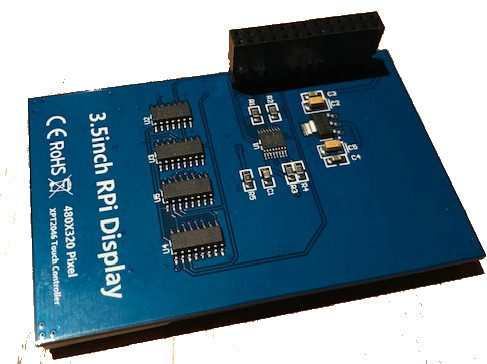
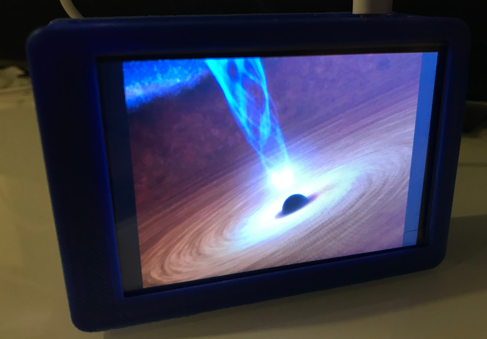

# Arduino

Notes on Arduino libraries and sketches and other related stuff.

<!-- vim-markdown-toc GFM -->

* [Libraries](#libraries)
    * [JLed](#jled)
    * [log4arduino](#log4arduino)
    * [esp32-aws-iot](#eps32-aws-iot)
* [Sketches](#sketches)
    * [Interfacing SSD1306 based OLED displays (SPI)](#interfacing-ssd1306-based-oled-displays-spi)
    * [Colorduino RGB matrix driver](#colorduino-rgb-matrix-driver)
    * [CJMCU-8x8 RGB matix](#cjmcu-8x8-rgb-matix)
    * [WEMOS D-Duino](#wemos-d-duino)
    * [ESP32 TTGO](#esp32-ttgo)
    * [Heltec WiFi Lora 32](#heltec-wifi-lora-32)
    * [Raspberry Pi 480x320 SPI TFT Display (3.5 inches)](#raspberry-pi-480x320-spi-tft-display-35-inches)
        * [Further info](#further-info)

<!-- vim-markdown-toc -->

## My Libraries

### JLed

JLed is an Arduino library to control LEDs. It uses a non-blocking approach and
can control LEDs in simple (on/off) and complex (blinking, breathing) ways in a
time-driven manner.


```c++
// breathe LED (on gpio 9) 6 times for 1500ms, waiting for 500ms after each run
#include <jled.h>

auto led_breathe = JLed(9).Breathe(1500).Repeat(6).DelayAfter(500);

void setup() { }

void loop() {
  led_breathe.Update();
}
```
* https://github.com/jandelgado/jled

### log4arduino

A lightweight, no-frills logging library for Arduino & friends.

```c++
LOG("hello, log4arduino.");
delay(42);
LOG("use %s formatting: %d %c %d %c %d", "printf", 9, '+', 1, '=', 10);
```

Allows simple printf-like formatting and shows current time in millis and available memory, e.g.

```
0(1623): hello, log4arduino.
42(1609): use printf formatting: 9 + 1 = 10
```

* https://github.com/jandelgado/log4arduino

### eps32-aws-iot

Code, tools and instructions on how to connect ESP32 securely to the AWS IOT cloud.

* https://github.com/jandelgado/esp32-aws-iot

## Sketches

To build the demo sketches you can either copy the folders to the source 
folder of your Arduino IDE or use PlatformIO and the provided makefiles, e.g.:

```
$ cd cjmcu_8x8_sample
$ make upload
```

The following make targets can be used: run, envdump, clean, upload, monitor

### Interfacing SSD1306 based OLED displays (SPI)


* [ssd1306_sample_adafruit](ssd1306_sample_adafruit) - sample code for ssd1306 based oled display. see [wiki](http://github.com/jandelgado/arduino/wiki/SSD1306-based-OLED-connected-to-Arduino) for detailed information
* [ssd1306_sample_u8g](ssd1306_sample_u8g) - sample code for ssd1306 based oled display. see [wiki](http://github.com/jandelgado/arduino/wiki/SSD1306-based-OLED-connected-to-Arduino) for detailed information


### Colorduino RGB matrix driver

Driver for 8x8 RGB LED matrix.


* see [wiki](https://github.com/jandelgado/arduino/wiki/Colorduino) for detailed information


### CJMCU-8x8 RGB matix

An 8x8 LED RGB matrix based on WS2812 "NeoPixels".


* see [README of example sketch](cjmcu_8x8_sample/README.md) for detailed info
rmation.

### WEMOS D-Duino

The Wemos D-Duino is an ESP8266 board with an integrated SSD1306 OLED display
connected via I2C. 


* SSD1306 is connected with I2C and SCL connected to D2 and SDA connected
  to D1.
* see [example sketch](wemos_d_duino) for an example on how to use it with 
  the u8g2 library.

### ESP32 TTGO

The ESP32 TTGO is an EPS32 with an integrated SSD1306 OLED display connected
via I2C. The board also has a 18650 battery holder on the back, and and on-off
switch.


* SSD1306 is connected with I2C and SCL connected to GPIO4 and SDA connected
  to GPIO5.
* see [example sketch](esp32_ttgo) for an example on how to use it with 
  the u8g2 library.

### Heltec WiFi Lora 32

The Heltec Wifi Lora 32 is an ESP32 board with a builtin OLED display and LORA
transceiver.


* the builtin LED is connected to `GPIO 25` (e.g. use `digitalWrite(25, 255)`)
* OLED: u8glib configuration `U8X8_SSD1306_128X64_NONAME_SW_I2C u8x8(/* clock=*/ 15, /* data=*/ 4, /* reset=*/ 16);`
* see [example sketch](heltec_wifi_lora32) for an example on how to use the OLED
* TODO will add Lora example later ...

### Raspberry Pi 480x320 SPI TFT Display (3.5 inches)




The display is labeled with `RPi Display 480x320 Pixel XPT246 Touch Controller`
and uses an `ILI9486` controller. In raspian (tested with `2018-11-13 Raspian`). 
no additional drivers are needed. I got it running with the following configuration:

Add to `/boot/config.txt`:
```
dtparam=spi=on
dtoverlay=piscreen,speed=16000000,rotate=270,fps=20
```

(note that the 20 fps are not reached), After reboot, check with `dmesg` that
the driver was loaded (framebuffer and touchscreen):

```
 12.814215] ads7846 spi0.1: touchscreen, irq 169
[   12.815503] input: ADS7846 Touchscreen as /devices/platform/soc/3f204000.spi/spi_master/spi0/spi0.1/input/input0
[   12.839795] fbtft: module is from the staging directory, the quality is unknown, you have been warned.
[   12.852267] fb_ili9486: module is from the staging directory, the quality is unknown, you have been warned.
[   12.853073] fbtft_of_value: regwidth = 16
[   12.853083] fbtft_of_value: buswidth = 8
[   12.853092] fbtft_of_value: debug = 0
[   12.853098] fbtft_of_value: rotate = 90
[   12.853105] fbtft_of_value: fps = 20
...
[   13.613788] graphics fb1: fb_ili9486 frame buffer, 480x320, 300 KiB video memory, 4 KiB buffer memory, fps=20, spi0.0 at 16 MHz
```

Test the display by loading an image using the `fbi` tool:
```
$ sudo fbi -noverbose -T 1 -a -d /dev/fb1 image-test.gif
```

(sudo is needed when command is run from ssh session).

Start X11 on the framebuffer with `sudo FBDEV=/dev/fb1 startx`.

#### Further info

* http://ozzmaker.com/piscreen-driver-install-instructions-2/
* [Adafruit info on FPS and SPI speed](https://learn.adafruit.com/adafruit-pitft-28-inch-resistive-touchscreen-display-raspberry-pi/help-faq#faq-11)
* RPi case used: https://www.thingiverse.com/thing:1229473


