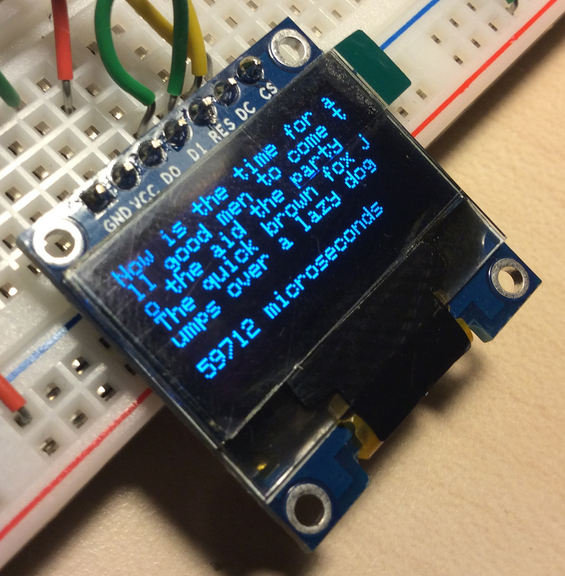
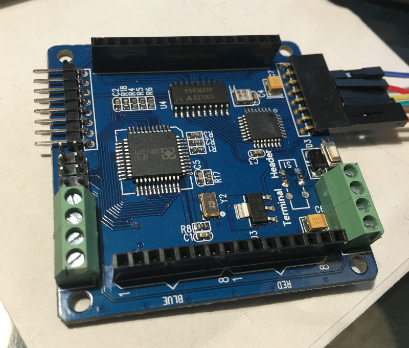
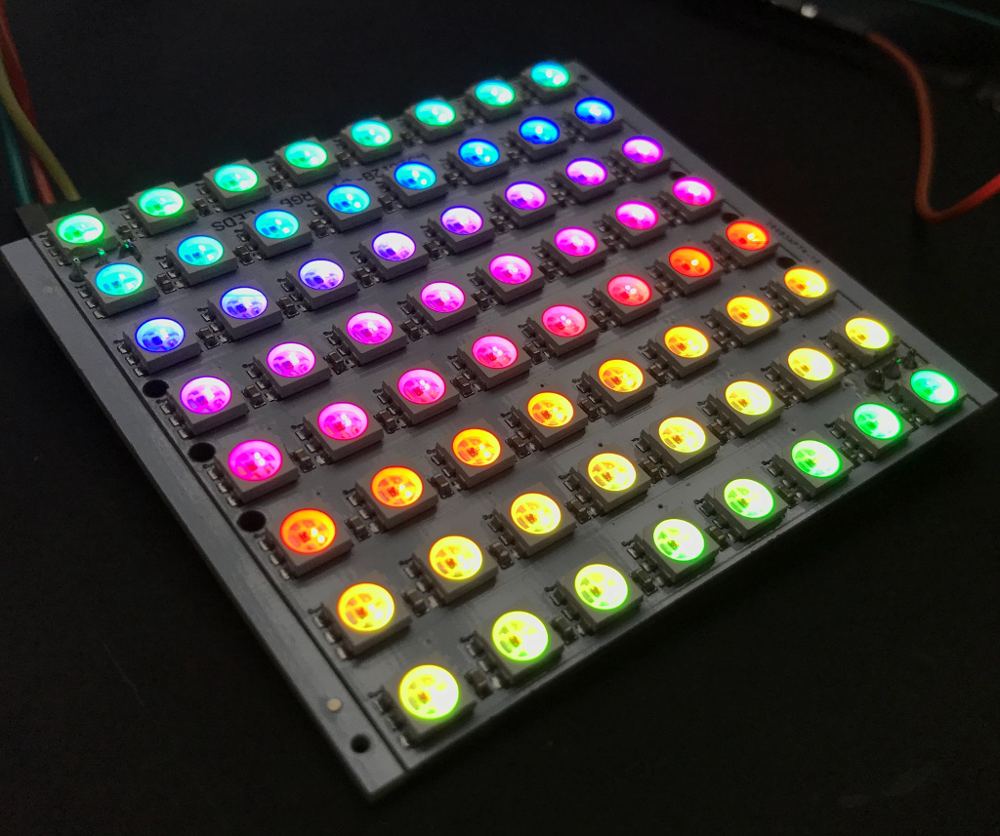
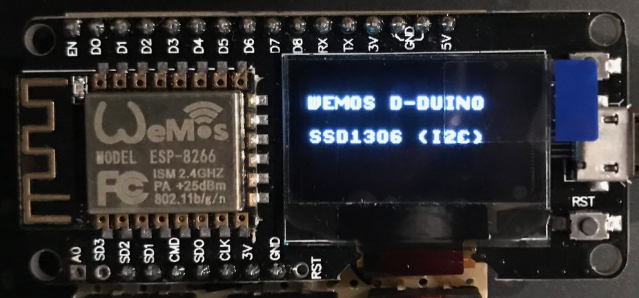
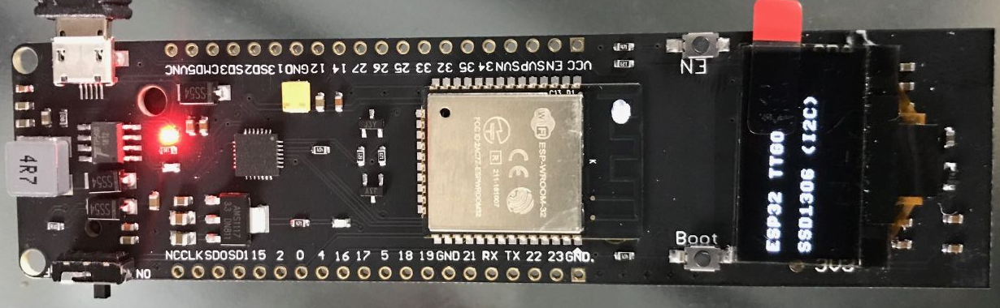
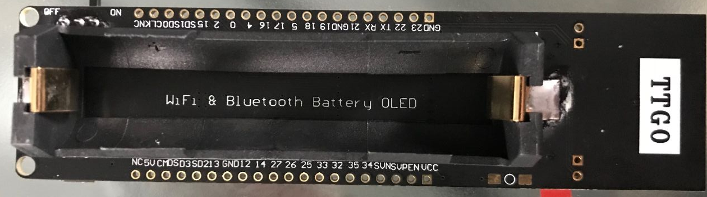
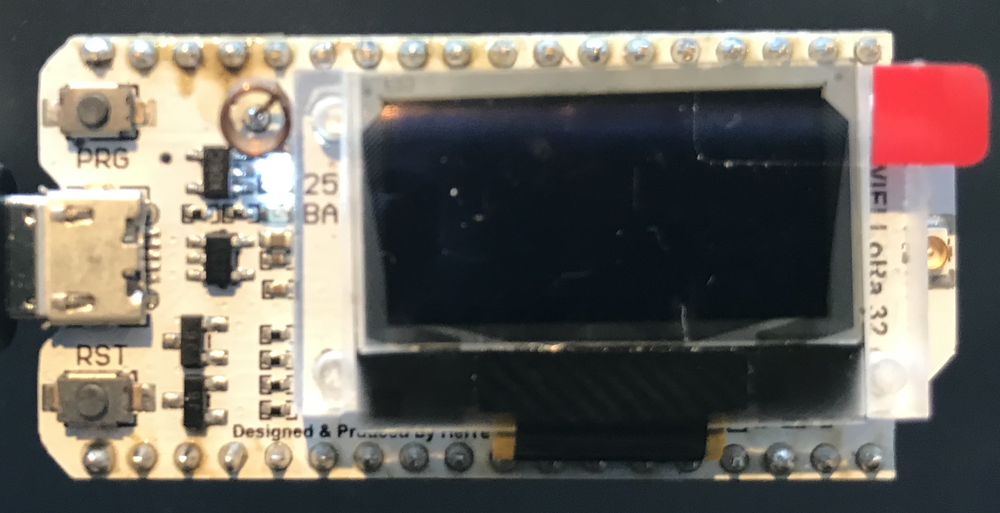

# arduino

Arduino libraries and sketches.


<!-- vim-markdown-toc GFM -->

* [Libraries](#libraries)
    * [JLed](#jled)
    * [log4arduino](#log4arduino)
* [Sketches](#sketches)
    * [Interfacing SSD1306 based OLED displays (SPI)](#interfacing-ssd1306-based-oled-displays-spi)
    * [Colorduino RGB matrix driver](#colorduino-rgb-matrix-driver)
    * [CJMCU-8x8 RGB matix](#cjmcu-8x8-rgb-matix)
    * [WEMOS D-Duino](#wemos-d-duino)
    * [ESP32 TTGO](#esp32-ttgo)
    * [Heltec WiFi Lora 32](#heltec-wifi-lora-32)

<!-- vim-markdown-toc -->

## Libraries

### JLed

JLed is an Arduino library to control LEDs. It uses a non-blocking approach and
can control LEDs in simple (on/off) and complex (blinking, breathing) ways in a
time-driven manner.


* https://github.com/jandelgado/jled

### log4arduino

A lightweight, no-frills logging library for Arduino & friends.

```c++
LOG("hello, log4arduino.");
LOG("use %s formatting: %d %c %d %c %d", "printf", 9, '+', 1, '=', 10);
```

* https://github.com/jandelgado/log4arduino

## Sketches

### Interfacing SSD1306 based OLED displays (SPI)



* [ssd1306_sample_adafruit](ssd1306_sample_adafruit) - sample code for ssd1306 based oled display. see [wiki](http://github.com/jandelgado/arduino/wiki/SSD1306-based-OLED-connected-to-Arduino) for detailed information
* [ssd1306_sample_u8g](ssd1306_sample_u8g) - sample code for ssd1306 based oled display. see [wiki](http://github.com/jandelgado/arduino/wiki/SSD1306-based-OLED-connected-to-Arduino) for detailed information


### Colorduino RGB matrix driver

Driver for 8x8 RGB LED matrix.



* see [wiki](https://github.com/jandelgado/arduino/wiki/Colorduino) for detailed information


### CJMCU-8x8 RGB matix

An 8x8 LED RGB matrix based on WS2812 "NeoPixels".



* see [README of example sketch](cjmcu_8x8_sample/README.md) for detailed info
rmation.

### WEMOS D-Duino

The Wemos D-Duino is an ESP8266 board with an integrated SSD1306 OLED display
connected via I2C. 



* SSD1306 is connected with I2C and SCL connected to D2 and SDA connected
  to D1.
* see [example sketch](wemos_d_duino) for an example on how to use it with 
  the u8g2 library.

### ESP32 TTGO

The ESP32 TTGO is an EPS32 with an integrated SSD1306 OLED display connected
via I2C. The board also has a 18650 battery holder on the back, and and on-off
switch.




* SSD1306 is connected with I2C and SCL connected to GPIO4 and SDA connected
  to GPIO5.
* see [example sketch](esp32_ttgo) for an example on how to use it with 
  the u8g2 library.

### Heltec WiFi Lora 32

The Heltec Wifi Lora 32 is an ESP32 board with builtin OLED display and LORA
transceiver.



* the builtin LED is connected to `GPIO 25` (e.g. use `digitalWrite(25, 255)`) 
  and low active.
* OLED: u8glib configuration `U8X8_SSD1306_128X64_NONAME_SW_I2C u8x8(/* clock=*/ 15, /* data=*/ 4, /* reset=*/ 16);`
* more to come

