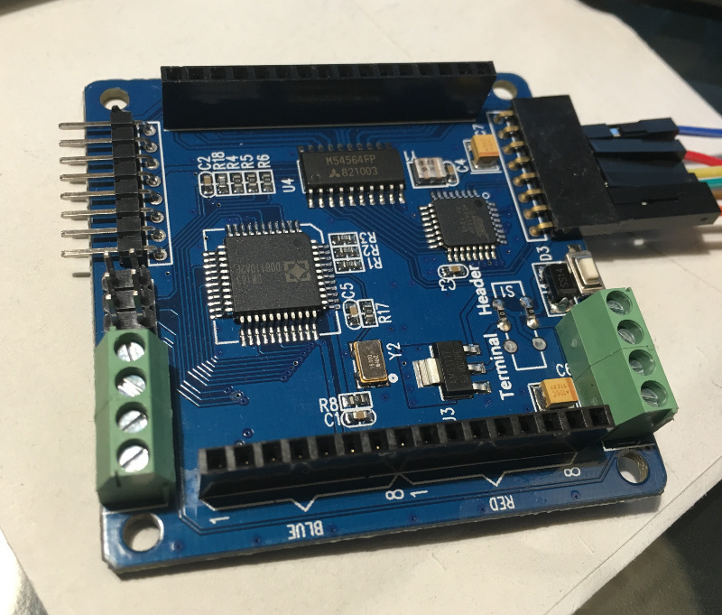
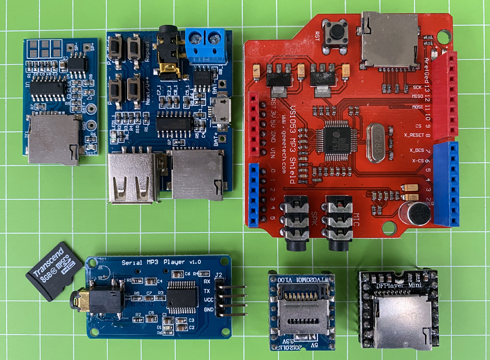

# Arduino

Notes on Arduino libraries and sketches and other related stuff.

<!-- vim-markdown-toc GFM -->

* [My Libraries and projects](#my-libraries-and-projects)
    * [JLed](#jled)
    * [log4arduino](#log4arduino)
    * [eps32-aws-iot](#eps32-aws-iot)
    * [USB Spinner Game Controller](#usb-spinner-game-controller)
    * [Simpson Device (virtual Drinking Bird)](#simpson-device-virtual-drinking-bird)
* [Sketches](#sketches)
    * [Interfacing SSD1306 based OLED displays (SPI)](#interfacing-ssd1306-based-oled-displays-spi)
    * [Colorduino RGB matrix driver](#colorduino-rgb-matrix-driver)
    * [CJMCU-8x8 RGB matix](#cjmcu-8x8-rgb-matix)
    * [WEMOS D-Duino](#wemos-d-duino)
    * [ESP32 TTGO](#esp32-ttgo)
    * [Heltec WiFi Lora 32](#heltec-wifi-lora-32)
    * [Raspberry Pi 480x320 SPI TFT Display (3.5 inches)](#raspberry-pi-480x320-spi-tft-display-35-inches)
        * [Further info](#further-info)
    * [Sipeed Longan Nano RISC-V proto board (GD32VF103CBT6)](#sipeed-longan-nano-risc-v-proto-board-gd32vf103cbt6)
        * [DFU mode](#dfu-mode)
        * [Upload demo sketch](#upload-demo-sketch)
        * [TODO](#todo)
    * [Raspberry Pi HDMI LCD display (800x480, 4")](#raspberry-pi-hdmi-lcd-display-800x480-4)
    * [Raspberry Pi Pico (RP2040)](#raspberry-pi-pico-rp2040)
    * [PCA9685 driver board](#pca9685-driver-board)
    * [MP3 Modules](#mp3-modules)
        * [Geeetch VS1053 notes](#geeetch-vs1053-notes)
* [Misc](#misc)
    * [WS2812 protection circuit](#ws2812-protection-circuit)
* [Author](#author)

<!-- vim-markdown-toc -->

## My Libraries and projects

### JLed

JLed is an Arduino library to control LEDs. It uses a non-blocking approach and
can control LEDs in simple (on/off) and complex (blinking, breathing) ways in a
time-driven manner.


```c++
// breathe LED (on gpio 9) 6 times for 1500ms, waiting for 500ms after each run
#include <jled.h>

auto led_breathe = JLed(9).Breathe(1500).Repeat(6).DelayAfter(500);

void setup() { }

void loop() {
  led_breathe.Update();
}
```
* https://github.com/jandelgado/jled

### log4arduino

A lightweight, no-frills logging library for Arduino & friends.

```c++
LOG("hello, log4arduino.");
delay(42);
LOG("use %s formatting: %d %c %d %c %d", "printf", 9, '+', 1, '=', 10);
```

Allows simple printf-like formatting and shows current time in millis and
available memory, e.g.

```
0(1623): hello, log4arduino.
42(1609): use printf formatting: 9 + 1 = 10
```

* https://github.com/jandelgado/log4arduino

### eps32-aws-iot

Code, tools and instructions on how to connect ESP32 securely to the AWS IOT
cloud.

* https://github.com/jandelgado/esp32-aws-iot

### USB Spinner Game Controller

An Arduino Pro Micro based USB spinner (like a paddle) game controller. Great
to play games like e.g. Arkanoid. Simulates an USB mouse and needs no drivers.

* https://github.com/jandelgado/usb-spinner

### Simpson Device (virtual Drinking Bird)

Simulates an USB mouse using an Attiny85 (Digispark board) and randomly moves
your mouse (see The Simpsons S07E07).

* https://github.com/jandelgado/simpson-device 

## Sketches

To build the demo sketches you can either copy the folders to the source 
folder of your Arduino IDE or use PlatformIO and the provided makefiles, e.g.:

```
$ cd cjmcu_8x8_sample
$ make upload
```

The following make targets can be used: run, envdump, clean, upload, monitor

### Interfacing SSD1306 based OLED displays (SPI)


* [ssd1306_sample_adafruit](ssd1306_sample_adafruit) - sample code for ssd1306 based oled display. see [wiki](http://github.com/jandelgado/arduino/wiki/SSD1306-based-OLED-connected-to-Arduino) for detailed information
* [ssd1306_sample_u8g](ssd1306_sample_u8g) - sample code for ssd1306 based oled display. see [wiki](http://github.com/jandelgado/arduino/wiki/SSD1306-based-OLED-connected-to-Arduino) for detailed information


### Colorduino RGB matrix driver

Driver for 8x8 RGB LED matrix.



* see [wiki](https://github.com/jandelgado/arduino/wiki/Colorduino) for detailed information


### CJMCU-8x8 RGB matix

An 8x8 LED RGB matrix based on WS2812 "NeoPixels".


* see [README of example sketch](cjmcu_8x8_sample/README.md) for detailed info
rmation.

### WEMOS D-Duino

The Wemos D-Duino is an ESP8266 board with an integrated SSD1306 OLED display
connected via I2C. 


* SSD1306 is connected with I2C and SCL connected to D2 and SDA connected
  to D1.
* see [example sketch](wemos_d_duino) for an example on how to use it with 
  the u8g2 library.

### ESP32 TTGO

The ESP32 TTGO is an EPS32 with an integrated SSD1306 OLED display connected
via I2C. The board also has a 18650 battery holder on the back, and and on-off
switch.

<p float="left">
  
  
</p>

* SSD1306 is connected with I2C and SCL connected to GPIO4 and SDA connected
  to GPIO5.
* see [example sketch](esp32_ttgo) for an example on how to use it with 
  the u8g2 library.

### Heltec WiFi Lora 32

The Heltec Wifi Lora 32 is an ESP32 board with a builtin OLED display and LORA
transceiver.


* the builtin LED is connected to `GPIO 25` (e.g. use `digitalWrite(25, 255)`)
* OLED: u8glib configuration `U8X8_SSD1306_128X64_NONAME_SW_I2C u8x8(/* clock=*/ 15, /* data=*/ 4, /* reset=*/ 16);`
* see [example sketch](heltec_wifi_lora32) for an example on how to use the OLED
* TODO will add Lora example later ...

### Raspberry Pi 480x320 SPI TFT Display (3.5 inches)

<p float="left">
  
  
</p>

The display is labeled with `RPi Display 480x320 Pixel XPT246 Touch Controller`
and uses an `ILI9486` controller. In raspian (tested with `2018-11-13 Raspian`). 
no additional drivers are needed. I got it running with the following configuration:

Add to `/boot/config.txt`:
```
dtparam=spi=on
dtoverlay=piscreen,speed=16000000,rotate=270,fps=20
```

(note that the 20 fps are not reached), After reboot, check with `dmesg` that
the driver was loaded (framebuffer and touchscreen):

```
 12.814215] ads7846 spi0.1: touchscreen, irq 169
[   12.815503] input: ADS7846 Touchscreen as /devices/platform/soc/3f204000.spi/spi_master/spi0/spi0.1/input/input0
[   12.839795] fbtft: module is from the staging directory, the quality is unknown, you have been warned.
[   12.852267] fb_ili9486: module is from the staging directory, the quality is unknown, you have been warned.
[   12.853073] fbtft_of_value: regwidth = 16
[   12.853083] fbtft_of_value: buswidth = 8
[   12.853092] fbtft_of_value: debug = 0
[   12.853098] fbtft_of_value: rotate = 90
[   12.853105] fbtft_of_value: fps = 20
...
[   13.613788] graphics fb1: fb_ili9486 frame buffer, 480x320, 300 KiB video memory, 4 KiB buffer memory, fps=20, spi0.0 at 16 MHz
```

Test the display by loading an image using the `fbi` tool:
```
$ sudo fbi -noverbose -T 1 -a -d /dev/fb1 image-test.gif
```

(sudo is needed when command is run from ssh session).

Start X11 on the framebuffer with `sudo FBDEV=/dev/fb1 startx`.

#### Further info

* http://ozzmaker.com/piscreen-driver-install-instructions-2/
* [Adafruit info on FPS and SPI speed](https://learn.adafruit.com/adafruit-pitft-28-inch-resistive-touchscreen-display-raspberry-pi/help-faq#faq-11)
* RPi case used: https://www.thingiverse.com/thing:1229473

### Sipeed Longan Nano RISC-V proto board (GD32VF103CBT6)

<p float="left">
  
  
</p>

The Sipeed Longan Nano GD32VF103CBT6 board hosts a 32-bit RISC-V cpu with 32KB
of SRAM and 128KB of Flash and a 160x80 Pixel RGB LCD display.

#### DFU mode

To upload a firmware image to the MCU, it has to be put into DFU mode first:
Press and hold `Boot` before connecting the board using USB. Alternatively when
the board is already connected: Press and hold `boot` and then `reset` to put
the board in DFU mode, otherwise no upload is possible.

Check with `lsusb|grep GD32` if the board was successfully detected, the output
should look like:

```
Bus 001 Device 007: ID 28e9:0189 GDMicroelectronics GD32 0x418 DFU Bootloader
```

Running `sudo dfu-util -l` yields:

```
dfu-util 0.9
...
Found DFU: [28e9:0189] ver=1000, devnum=7, cfg=1, intf=0, path="1-2", alt=1, name="@Option Bytes  /0x1FFFF800/01*016 g", serial="??"
Found DFU: [28e9:0189] ver=1000, devnum=7, cfg=1, intf=0, path="1-2", alt=0, name="@Internal Flash  /0x08000000/512*002Kg", serial="??"
```

#### Upload demo sketch 

Before uploading to the MCU, make sure you installed [the udev rules as described here](https://docs.platformio.org/en/latest/faq.html#faq-udev-rules). Afterwards a
`udevadm control --reload-rules && udevadm trigger` (as root) might be necessary.

The [demo sketch](sipeed_longan_nano) can be compiled
and uploaded with `make upload`, after the board was set to DFU mode. The
following error seems to have no effect, and can be ignored:

```
dfu-util: dfuse_download: libusb_control_transfer returned -1
*** [upload] Error 74
```

If the demo sketch works, you should now see the builtin LEDs cycle in colors
red, green and blue.

#### TODO

- [ ] LCD demo w/ arduino framework
- [ ] JLed demo

### Raspberry Pi HDMI LCD display (800x480, 4")

<p float="left">
  
  
</p>

The display is labelled "4inch HDMI LCD". The resolution is 800x480 and the 
display has a built in XPT2046 touch controller.

I had to power both the Raspi (RPi 3) and the display to get it run. The display
needs a custom resolution in `/boot/config.txt`, which is set by  `hdmi_mode=87`
and `hdmi_cvt`.

Add to `/boot/config.txt`:

```
framebuffer_width=800
framebuffer_height=480

hdmi_group=2
hdmi_mode=87
hdmi_cvt=480 800 60 6
display_hdmi_rotate=3
```

- [ ] Test the touch controller

### Raspberry Pi Pico (RP2040)


The Raspberry Pi Pico is a cheap but powerful new (end of 2020) micro
controller. It features a dual core Arm cortex M0+ processor running with up to
133Mhz, 264Kb SRAM and 2MB flash memory. It has no WiFi or Bluetooth.

To flash the Pico, press the `BOOTSEL` button and attach the Pico using USB to
your PC. The Pico will now act mass storage USB device. Simply copy the
firmware (`uf2` extension) to the drive. The Pico will automatically disconnect
and reboot.

The Raspberry Pi Pico can be programmed in C/C++ or MicroPython. For C/C++ the
[pico-sdk](https://github.com/raspberrypi/pico-sdk) and CMake must be used,
which is not as easy to use as e.g. the Arduino IDE or platformio. To make
things easier, I have created a [docker
image](https://github.com/jandelgado/jled/blob/4.7.0/examples/raspi_pico/Dockerfile)
and a [simple build script](https://github.com/jandelgado/jled/blob/4.7.0/examples/raspi_pico/build.sh).

* [Look here for an example in my JLed library](https://github.com/jandelgado/jled/tree/4.7.0/examples/raspi_pico)
* [official getting started guide](https://www.raspberrypi.org/documentation/pico/getting-started/)

### PCA9685 driver board

The PCA9685 is an **I2C bus** controlled LED/Servo controller **with 16
individually controllable PWM channels**. Each channel has a resolution of 12
bits, resulting in 4096 steps. All channels operate at the same fixed
frequency, which must be in the range between 24Hz and 1526Hz. 

The board operates at 3V to 5V, which is fed through the VCC pin. The V+ pin
is optional and is used to power servos or LEDs with up to 6V. The V+ voltage
can also be fed through the green terminal block and is routed to the red V+
pins.

Each of the yellow PWM outputs on the board has a 220 Ohms resistor in series,
which allows the direct connection of a LED. The output level is the same as
VCC.

SDA and SCL are the I2C data and clock pins. The OE pin is optional (and pulled
down by default) and is used to quickly disable all outputs (by setting OE to
high level).

The I2C address is by default `0x40` and can be changed by closing the `A0` to 
`A5` pins using a soldering iron.


There are many libraries for PCA9685 based boards out there, I successfully
used the [Adafruit PWM Servo Driver
library](https://github.com/adafruit/Adafruit-PWM-Servo-Driver-Library). 
Have a look at [this example here](pca9685).

### MP3 Modules

I recently [built a Music Box for Kids](https://github.com/jandelgado/carl) and
evaluated some MP3 modules to find the right one for the job (I finally ended
up using the DFPlayer Mini).



|                  | WTV020M01 V1.00                    | DFPlayer Mini                                          | Catalex Serial MP3 Player V1.0                              | VS1053 MP3 Shield (geeetech)                                                     | GPD2856A based                                      |
|------------------|------------------------------------|--------------------------------------------------------|-------------------------------------------------------------|----------------------------------------------------------------------------------|-----------------------------------------------------|
| Dimensions (mm)  | 22x17                              | 20x20                                                  | 40x23                                                       | 55x55                                                                            | 45x35, 22x34                                        |
| VCC              | 3.3V                               |                                                        | 3.2V-5.2V                                                   |                                                                                  | 3.7V-5V                                             |
| Current          |                                    |                                                        |                                                             |                                                                                  |                                                     |
| Chip             | ?                                  | ?                                                      | YX5300                                                      | VLSI VS1053B                                                                     | GPOD2856A                                           |
| Media            | Micro SD, 1 or 2GB, very picky     | Micro SD up to 32GB                                    | Micro SD up to GB                                           | Micro SD                                                                         |                                                     |
| Filesystem       | FAZT16/32                          | FAT16/32                                               | FAT16/32                                                    | FAT16/32                                                                         |                                                     |
| Max Files        | 512                                | 100*255                                                | ?                                                           | ?                                                                                | ?                                                   |
| Formats          | AD4,NO MP3                         | MP3, WAV                                               | MP3, WAV                                                    | MP1,MP2,MP3,MP4,AAC,OGG,WAV and more                                             |                                                     |
| Frequency        | 32kHz                              | 8-48kHz                                                | 11-48kHz                                                    |                                                                                  | 2W Mono                                             |
| Amplifier        | Yes                                | Yes                                                    | Line out only                                               |                                                                                  |                                                     |
| Buttons          | Opt.: Play, Prev, Next, Vol+, Vol- | Optional                                               | No                                                          |                                                                                  | Play,  Prev, Next, Vol+, Vol-                       |
| Serial Interface | 2 Line + CLK                       | UART 9600bps                                           | UART 9600bps                                                |                                                                                  |                                                     |
| Microphone       | No                                 | No                                                     | No                                                          | Record in OGG, WAV                                                               |                                                     |
| Misc             | Busy signal, Reset input           | Busy signal, Equalizer                                 |                                                             |                                                                                  |                                                     |
| Price (04/2021)  | ca. 4€                             | Starting at 1€                                         | ca. 2€                                                      | ?                                                                                | starting at 1€                                      |
| Library          |                                    | [Link](https://github.com/DFRobot/DFRobotDFPlayerMini) | [Link](https://github.com/cefaloide/ArduinoSerialMP3Player) | [Link](https://github.com/madsci1016/Sparkfun-MP3-Player-Shield-Arduino-Library) | n/a                                                 |
| Site             |                                    |                                                        |                                                             |                                                                                  |                                                     |
| Comment          | Better use DFPlayer Mini instead   |                                                        |                                                             | Many features, good documentation                                                | Standalone Player, w/ and wo/ buttons and terminals |

Summary:
* WTV020M01 is not recommended since not supporting MP3 format and very
  restrictive regarding SD cards used and audio encoding
* The GPD2856A based boards are designed as stand alone players and are not
  meant to be controlled by a micro controller.  
* The DFPlayer Mini is a reliable board which can be controlled by a micro
  controller. It has an amplifier built in as well as an equalizer.
* The VL1053 based shield supports many file formats and even recording of
  audio. It lacks an amplifier but is otherwise feature-packed.
* The Catalex board is very simple to use and can be controlled by a micro
  controller. It lacks an amplifier and offers only a serial interface for
  control.

Addiontial links: 
* DFPlayerMini: https://wiki.dfrobot.com/DFPlayer_Mini_SKU_DFR0299
* Catalex: http://geekmatic.in.ua/pdf/Catalex_MP3_board.pdf
* GPD2856A: https://www.petervis.com/Electronics_Kits/gpd2856a/gpd2856a-mp3-decoder-board.html
* WTV020M01: https://hackaday.io/project/3508-portable-trollmaster-3000/log/12391-the-joy-of-using-an-underdocumented-module-and-using-a-plan-b-at-the-last-minute
* Geeetch VS1053: http://www.geeetech.com/wiki/index.php/Arduino_MP3_shield_board_with_TF_card
    * Profiles for the VS1053: http://www.vlsi.fi/en/support/software/vs10xxapplications.html

#### Geeetch VS1053 notes

The module is also capable to record audio on the SD card in OGG Vorbis and WAV
format. To encode the audio in OGG format, a plugin needs to be loaded from the
SD card. The plugins are available [here at
VLSI](http://www.vlsi.fi/fileadmin/software/VS10XX/vs1053-vorbis-encoder-170c.zip).
Pick yours from the `profiles/` directory (files with `.img` extension). The
name of the plugin is passed to the `prepareRecordingOgg` function. I had to
change the name to conform to 8.3 naming (e.g. `v08k1q06.img`), otherwise the
plugin did not load.  Refer to the
[documentation](http://www.vlsi.fi/fileadmin/software/VS10XX/VorbisEncoder170c.pdf)
for more details.

Libraries and examples: 
* https://github.com/adafruit/Adafruit_VS1053_Library
* https://github.com/madsci1016/Sparkfun-MP3-Player-Shield-Arduino-Library

## Misc

### WS2812 protection circuit

I use this circuit when I connect WS2812 "neo pixels" to micro controllers (connected to `DATA` pin).


## Author

(c) Copyright 2018-2021 by Jan Delgado. License: MIT

