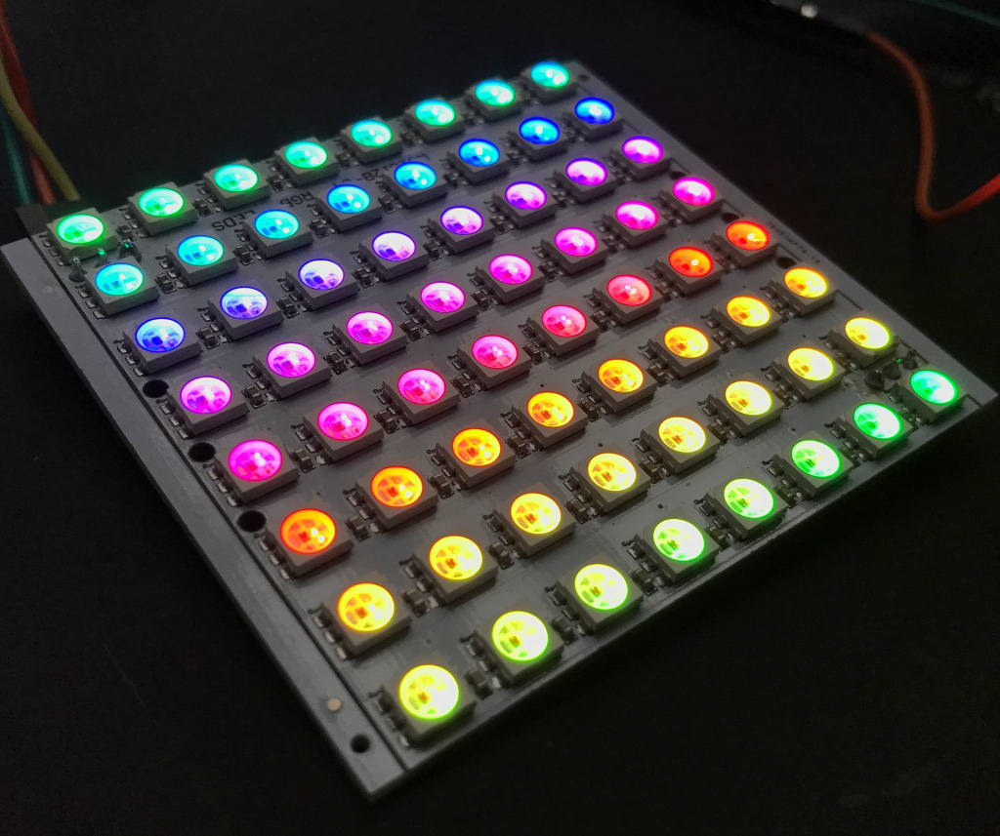
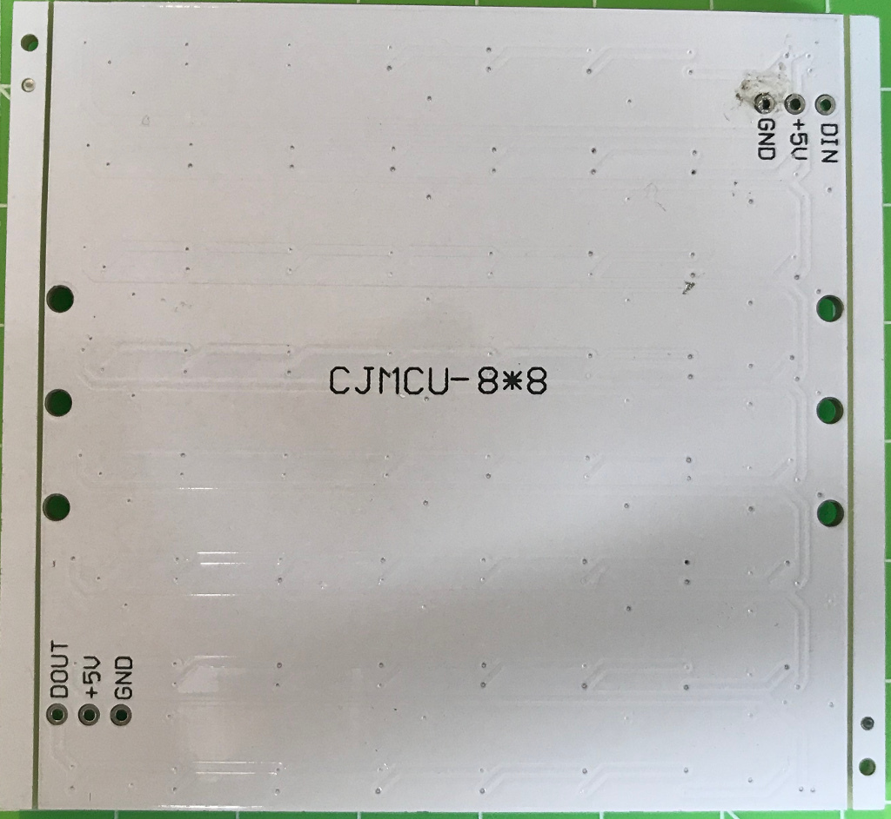

# CJMCU-8*8 LED RGB Matrix

I recently got some of those `CMCJU-8*8` labeled LED RGB Matrix boards.
According to what is printed on the boards, they are opposed to be built
up on `WS2812B` RGB "Neopixel" LEDs. Connecting the matrix to an Arduino however,
I had no luck at all on my first attempt. Later I found that these PCBs were
totally misleadingly labeled:

* `DIN` and `DOUT` labels are exchanged
* the board uses `WS2812` LEDs, which use the WS2811 driver IC (but is labeled as
  `WS2812B`)

| Front | Back |
| ----- | ---- |
|  |  |

Knowing that, I could get the board up and running using the FastLED library
without problem. [See the Demo sketch for an example](cjmcu_8x8/cjmcu_8x8.ino).

Since the WS2812 (which is an WS2811 driver IC packaged with a LED) and the WS2812B
use the same protocol, the difference in type make no difference in interfacing
the LEDs with e.g. the [FastLED library](https://github.com/FastLED/FastLED).

## Spot the difference

The WS2812 uses a 6 pin package. So if your LEDs have 6 pins instead of 4,
then chances are your PCB is populated with WS2812 LEDs.

